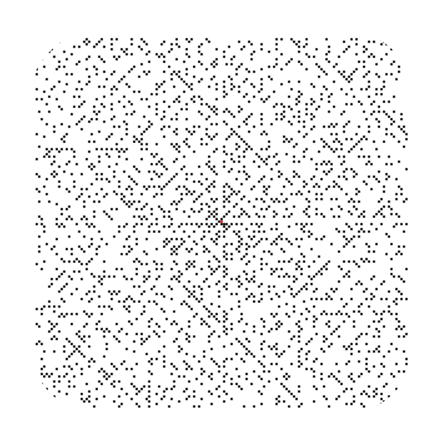

<h3 align="center">
  
</h3>

# Prime numbers generator

[Eratosthenes Sieve](https://en.wikipedia.org/wiki/Sieve_of_Eratosthenes) based prime numbers generator written in Swift.

## How does it work?

<h3 align="center">
  
</h3>

To find all the prime numbers less than or equal to a given integer n:

1. Create an Eratosthenes Sieve. Initially, it should be an array of n true bools. Each bool indicates whether a value on a corresponding index is a prime or not.
2. Create an empty array for storing primes.
3. Mark first two bools as false, as both 0 and 1 are not primes.
4. Then iterate through the sieve and for every true value
   - mark it's each multiple as not prime
   - add it to the primes array
5. Both multiplication and iteration through the sieve are limited by upper bound n.
6. Ultimately we have an array of primes.

## Author

**Greg (Grzegorz) Surma**

[**PORTFOLIO**](https://gsurma.github.io)

[**GITHUB**](https://github.com/gsurma)

[**BLOG**](https://medium.com/@gsurma)

